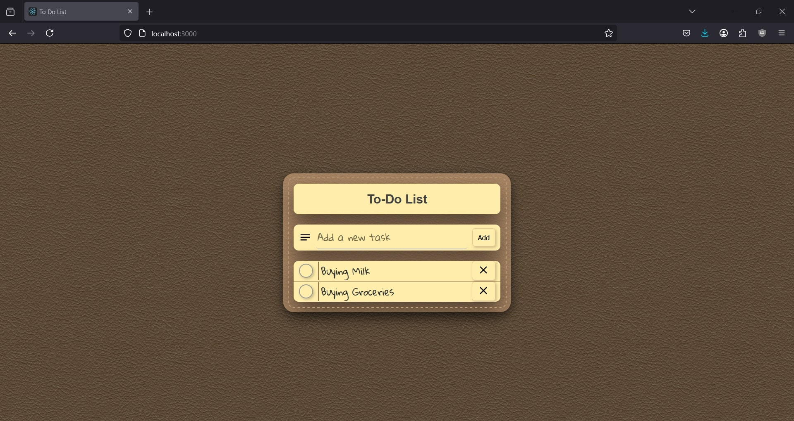

# NoteSatchel-ToDoList
A simple and intuitive To-Do List App built with React.

Features
- Add new tasks with a customizable text input
- Mark tasks as completed with a checkbox
- Delete tasks with a delete button
- Animated transitions for a smooth user experience
- Sound effects for a more engaging experience

Dependencies
- react: The React library.
- @mui/icons-material: Material-UI icons.
- Firebase SDK (firebase/app and firebase/database)

Requirements
- Create a .env file in the root directory with the following environment variables:
    - REACT_APP_API_KEY
    - REACT_APP_AUTH_DOMAIN
    - REACT_APP_DATABASE_URL
    - REACT_APP_PROJECT_ID
    - REACT_APP_STORAGE_BUCKET
    - REACT_APP_MESSAGING_SENDER_ID
    - REACT_APP_APP_ID

Usage
1. Clone the repository to your local machine.
2. Install the required dependencies by running npm install or yarn install.
3. Start the application by running npm start or yarn start.

Components
- App.js: The main application component.
- List.js: The component responsible for rendering individual tasks.
- AddList.js: The component responsible for adding new tasks.

Styles
- list.css: Styles for the List component.

Screenshots

License
- This project is licensed under the MIT License. See LICENSE for details.
